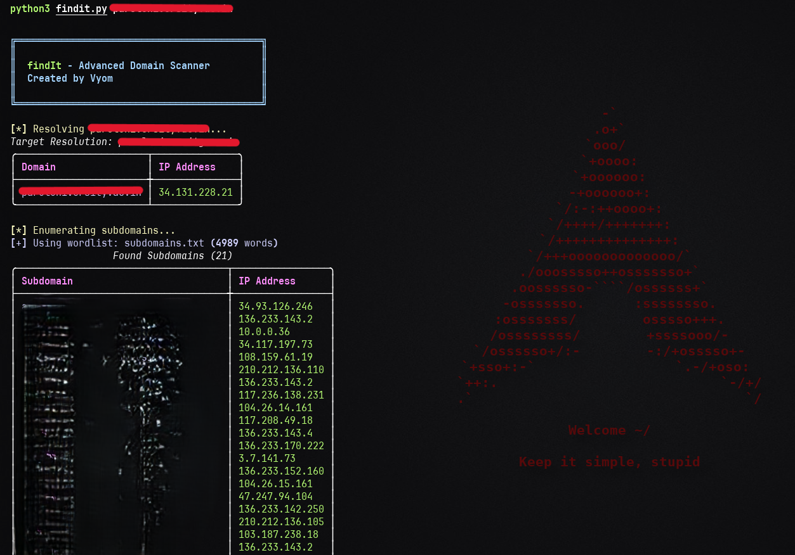

# FindIt - Advanced Domain Scanner

[](https://opensource.org/licenses/MIT)

`FindIt` is a comprehensive Python-based domain reconnaissance tool designed to gather extensive information about a target domain.

 

## Features
* **Domain Resolution:** Resolves the target domain to its IP address(es).
* **Subdomain Enumeration:** Discovers subdomains using common wordlist brute-forcing.
* **Port Scanning:** Performs port scanning using `nmap` to identify open TCP/UDP ports (optional).
* **Service & Version Detection:** Identifies services running on open ports and their versions (requires port scan).
* **OS Detection:** Attempts operating system fingerprinting using `nmap` (requires port scan).
* **Web Technology Detection:** Identifies common web technologies (CMS, frameworks, libraries, analytics) used by the target and its subdomains.
* **Directory Brute-Forcing:** Searches for common web directories using a wordlist. (Excludes 301 redirects by default).
* **Cloud Storage Check:** Looks for potential publicly accessible AWS S3 and Google Cloud Storage buckets based on common naming conventions.
* **TFTP Server Check:** Identifies potential TFTP servers based on nmap UDP scan results (requires port scan with UDP enabled).
* **Concurrent Scanning:** Utilizes threading for faster enumeration and checking.
* **Rich Console Output:** Presents results in well-formatted tables using the `rich` library.
* **File Reporting:** Saves scan results to `.txt` or `.json` files.

## Requirements

### Software:

1.  **Python 3:** Developed and tested with Python 3.6+.
2.  **nmap:** Required *only* if using the port scanning feature (`-p` or `--port-scan`). It must be installed and accessible in your system's PATH.
    * **Linux (Debian/Ubuntu):** `sudo apt update && sudo apt install nmap`
    * **Linux (Fedora/CentOS):** `sudo dnf install nmap` or `sudo yum install nmap`
    * **macOS (using Homebrew):** `brew install nmap`
    * **Windows:** Download from [nmap.org](https://nmap.org/download.html)

### Python Libraries:

You can install the required Python libraries using pip:

```bash
pip install -r requirements.txt
```

### Clone the Repo.
```bash
https://github.com/VyomJain6904/FindIt
```
